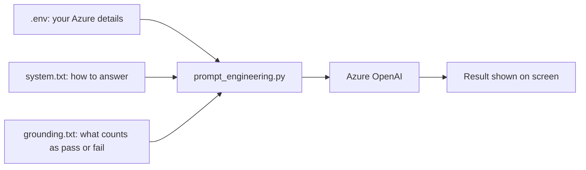
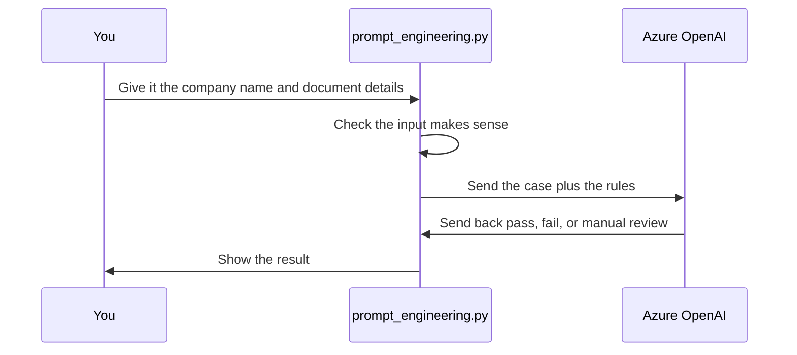

# Credit Risk Document Validation (Day 2 Lab)

## What this does

Before a credit officer opens a file, someone needs to check two things:

1. Are both documents there? Company Registration Certificate and GST Certificate. It only passes if both are present.
2. Does the client's company name match the name on both certificates, exactly?

That's the whole job. No MCA lookup, no sanctions check, no credit scoring, no OCR. You type in the case (is each document there, can it be read, and what name is on it), and the model checks it against a fixed set of rules.

## Why not just let a person check this

A person comparing two PDFs by eye is slow, and two people won't always agree. One might let "Pvt Ltd" vs "Private Limited" slide, another won't. This script doesn't get to make that call. It only trims extra spaces and ignores letter case. Everything else, spelling, abbreviations, legal suffixes, has to match exactly or it gets flagged. Every result is one of three states, PASS, FAIL, or MANUAL_REVIEW, with a reason attached, so a human can see why.

> [!NOTE]
> This is faster than a manual check, but it can go further. Azure's own OCR tool, Azure AI Vision (Read API), plus Azure Document Intelligence for structured documents, could read the uploaded certificates directly instead of someone typing in what's on them. Day 2 is focused on prompt engineering, so this lab sticks to that and leaves the OCR side for later.

## Architecture, in plain words

There's one script, `prompt_engineering.py`, and it does everything. Before it can talk to Azure, it needs three things ready on disk:

- `.env` holds your Azure address, your API key, and which model to use
- `system.txt` tells the model what it's allowed to do and how to answer
- `grounding.txt` holds the actual rules, what makes a case pass, fail, or need a human

The script reads all three, asks about the case in the terminal, puts everything into one message, and sends it to Azure. Azure sends back a verdict, and the script prints it. Nothing here touches a real file or a real government database. It's just text in, text out.



| File | What it's for |
|---|---|
| `prompt_engineering.py` | The script you run |
| `system.txt` | How the assistant should behave |
| `grounding.txt` | The rules for pass, fail, and manual review |
| `.env` | Your Azure login details |
| `requirements.txt` | The two libraries it needs, `openai` and `python-dotenv` |

## How a case flows through it, in plain words

Say you're checking a company called Contoso. Here's what happens:

1. You run the script and pick "start assessment."
2. It asks for the client's company name, then whether the Registration Certificate is there and readable, then the same for the GST Certificate. If a document is readable, it also asks what name is printed on it.
3. Before sending anything, the script checks that what you typed makes sense. Too short, too long, or blank, and it stops you there.
4. It combines your answers with the rules and the behaviour instructions, and sends all of it to Azure in one request.
5. Azure applies the rules and sends back a verdict: PASS, FAIL, or MANUAL_REVIEW, with the reasons.
6. The script prints that verdict. Nothing gets saved to a file.



## Running it

Create and activate a Python virtual environment, then install the dependencies:

```powershell
python -m venv labenv
.\labenv\Scripts\Activate.ps1
pip install -r requirements.txt
```

> [!NOTE]
> TLDR: if `python -m venv labenv` errors out on the VM, swap `python` for `py`:
> ```powershell
> py -m venv labenv
> .\labenv\Scripts\Activate.ps1
> pip install -r requirements.txt
> ```

Fill in `.env`:

```
AZURE_OPENAI_ENDPOINT=https://hakunamatata1.openai.azure.com/openai/v1/
AZURE_OPENAI_API_KEY=your_actual_api_key
AZURE_OPENAI_DEPLOYMENT=gpt-5.4-mini
```

Then run the script:

```
python prompt_engineering.py
```

Pick option 1, and it asks for the client name and the state of each document. Use these shortcuts:

| Shortcut | Meaning |
|---|---|
| PR | Present and readable |
| PU | Present but unreadable |
| PA | Present but unclear |
| MI | Missing |

## Test cases

**Pass**

```
Client: Contoso Technologies Pvt Ltd
Registration Certificate: PR, name = Contoso Technologies Pvt Ltd
GST Certificate: PR, name = CONTOSO TECHNOLOGIES PVT LTD
```

Result: PASS. Only the letter case is different, and that gets ignored.

**Fail**

```
Client: Contoso Technologies Pvt Ltd
Registration Certificate: PR, name = Contoso Technology Pvt Ltd
GST Certificate: PR, name = Contoso Technologies Pvt Ltd
```

Result: FAIL, COMPANY_NAME_MISMATCH. "Technology" and "Technologies" are actually different words, not a formatting issue.

**Manual review**

```
Client: Contoso Technologies Pvt Ltd
Registration Certificate: PU
GST Certificate: PR, name = Contoso Technologies Pvt Ltd
```

Result: MANUAL_REVIEW, UNREADABLE_REGISTRATION_CERTIFICATE. A document that's there but can't be read isn't the same as one that's missing, so it goes to a human instead of getting an automatic fail.
