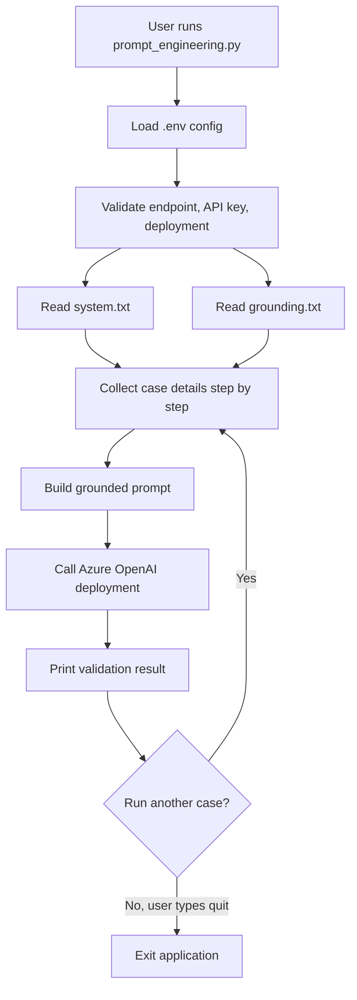

# Document Validation Assistant (Azure OpenAI)

Ever tried validating a stack of company documents by hand? Checking names against certificates, flagging what's missing, deciding what needs a second look? This tool does that as a quick command-line exercise: it asks you a few questions about a document validation case, then sends the details to an Azure OpenAI deployment for a verdict, using a system prompt and grounding rules you can edit yourself.

## Project structure

| File | Purpose |
|---|---|
| `prompt_engineering.py` | Main application. Loads config, collects user input step by step, builds the grounded prompt, and calls Azure OpenAI. |
| `system.txt` | Defines the assistant's role, behaviour, scope, and output format. Controls how the model thinks and responds. |
| `grounding.txt` | Contains the business and domain rules (required documents, pass/fail/manual-review logic, name comparison rules). Controls what the model knows. |
| `.env` | Stores Azure OpenAI credentials (endpoint, API key, deployment name). Don't commit this with real secrets in it. |
| `.gitignore` | Excludes `.venv/`, `venv/`, `__pycache__/`, and `*.pyc` from version control. |
| `requirements.txt` | Python dependencies (`openai`, `python-dotenv`). |

## How it works



## Prerequisites

* Python 3.12 or later
* An Azure OpenAI resource with a deployed chat model
* The deployment's endpoint URL, API key, and deployment name

You can get these from the Azure Portal:

1. Go to your Azure OpenAI resource.
2. Under "Keys and Endpoint," copy the endpoint and one of the API keys.
3. Under "Deployments" (or Azure AI Foundry), copy the deployment name of the model you want to use.

## Environment variables

Use default created `.env` file in the project root with these keys:

```
AZURE_OPENAI_ENDPOINT=https://<your-resource-name>.openai.azure.com/openai/v1/
AZURE_OPENAI_API_KEY=<your-api-key>
AZURE_OPENAI_DEPLOYMENT=<your-deployment-name>
```

A couple of notes:

* The endpoint must start with `https://` and end with `/openai/v1/`. Forget the trailing slash and the app will just add it for you.
* Don't push real API keys to a public repository.

**## Setup**

Create and activate a virtual environment, then install the required dependencies.

**On Windows (PowerShell):**

```powershell
py -m venv .venv
.venv\Scripts\Activate.ps1
pip install -r requirements.txt
```

**Note:** If `py -m venv .venv` does not work, try:

```powershell
python -m venv .venv
```

**If PowerShell blocks activation**, open Command Prompt and run:

```cmd
.venv\Scripts\activate.bat
```

**On macOS/Linux:**

```bash
python3 -m venv .venv
source .venv/bin/activate
pip install -r requirements.txt
```

## Running the application

```
python prompt_engineering.py
```

On startup, the app checks that `.env`, `system.txt`, and `grounding.txt` are present and valid. Then it starts an interactive loop and asks for:

1. Client company name
2. Registration Certificate state (`PRESENT_READABLE` / `PRESENT_UNREADABLE` / `MISSING`) and name, if readable
3. GST Certificate state and name, if readable

Type `quit` at any prompt to exit.

## Sample test cases

Try these to see the different outcomes for yourself.

### Case 1: expected PASS

```
Client company name: Contoso Technologies Pvt Ltd
Registration Certificate state: PRESENT_READABLE
Registration Certificate company name: Contoso Technologies Pvt Ltd
GST Certificate state: PRESENT_READABLE
GST Certificate company name: Contoso Technologies Pvt Ltd
```

### Case 2: expected FAIL (missing document)

```
Client company name: Northwind Traders Ltd
Registration Certificate state: MISSING
GST Certificate state: PRESENT_READABLE
GST Certificate company name: Northwind Traders Ltd
```

### Case 3: expected FAIL (name mismatch)

```
Client company name: Fabrikam Industries Ltd
Registration Certificate state: PRESENT_READABLE
Registration Certificate company name: Fabricam Industries Ltd
GST Certificate state: PRESENT_READABLE
GST Certificate company name: Fabrikam Industries Ltd
```

### Case 4: expected MANUAL_REVIEW (unreadable document)

```
Client company name: Adventure Works Pvt Ltd
Registration Certificate state: PRESENT_UNREADABLE
GST Certificate state: PRESENT_READABLE
GST Certificate company name: Adventure Works Pvt Ltd
```

### Case 5: expected MANUAL_REVIEW (ambiguous or partial name match)

```
Client company name: Global Traders Pvt Ltd
Registration Certificate state: PRESENT_READABLE
Registration Certificate company name: Global Traders Private Limited
GST Certificate state: PRESENT_READABLE
GST Certificate company name: Global Traders Pvt Ltd
```

## Customizing behaviour

Want the assistant to act differently? You don't need to touch any code.

* Edit `system.txt` to change the assistant's role, tone, scope, or output format.
* Edit `grounding.txt` to change required documents, pass/fail/manual-review rules, or name-matching logic.

Restart the application after editing either file to pick up the changes.

## Troubleshooting

| Symptom | Likely cause | Fix |
|---|---|---|
| "Missing required environment variable" | `.env` file is missing a key, or wasn't loaded | Check that `.env` exists in the project root and has all three keys |
| "Azure OpenAI endpoint must end with /openai/v1/" | Endpoint is malformed | Make sure the endpoint follows `https://<resource>.openai.azure.com/openai/v1/` |
| "Unable to contact Azure OpenAI" | Network issue, wrong endpoint, or wrong key | Check your internet connection, endpoint URL, API key, and deployment name |
| "system.txt was not found" / "grounding.txt was not found" | File missing from the project root | Make sure both files sit alongside `prompt_engineering.py` |