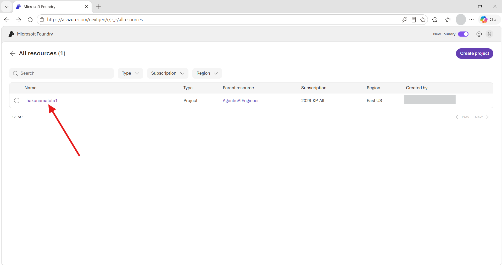
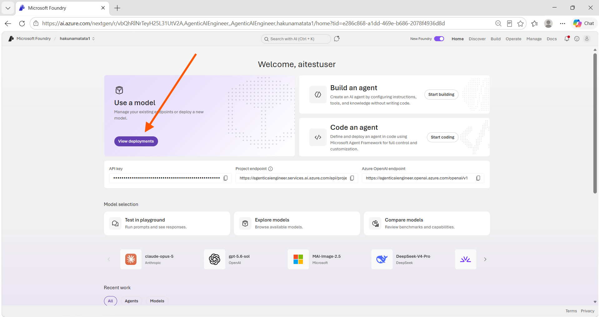
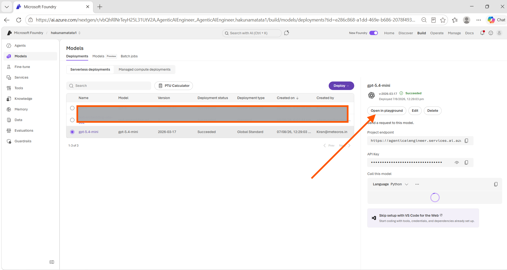
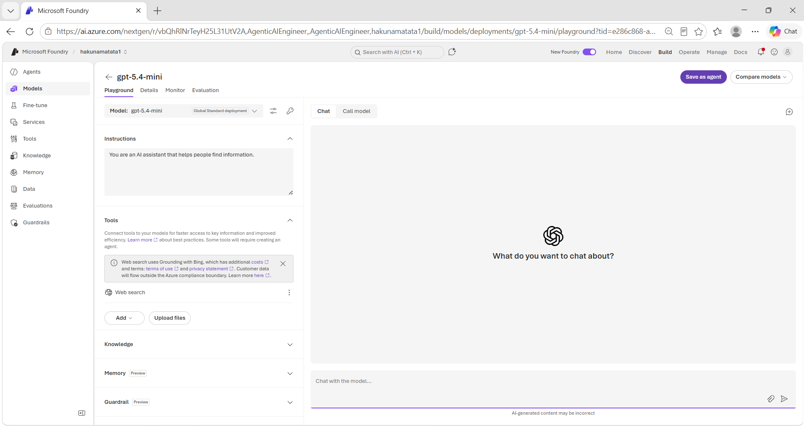
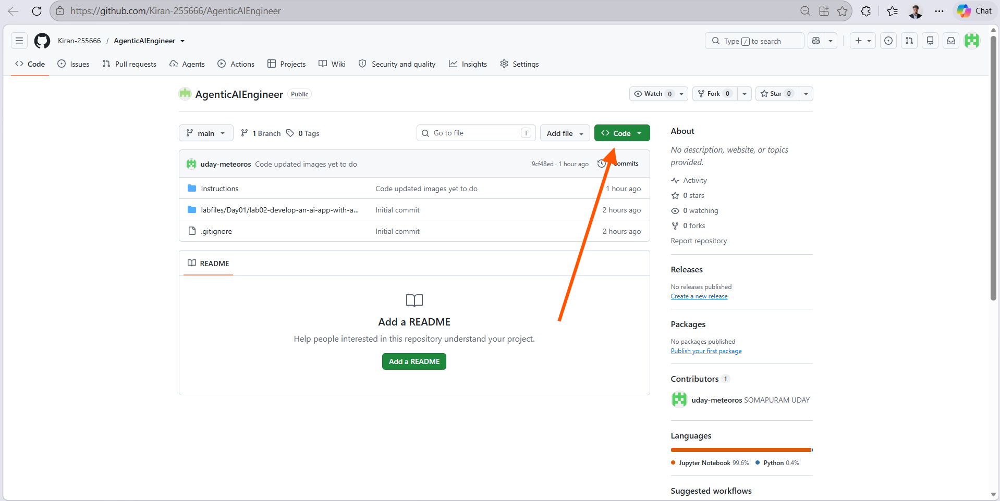

---
lab:
  title: Utilize prompt engineering in your app
  description: Learn how different prompt structures shape a generative AI model's response, then build a Python app to test them.
  level: 200
  duration: 30
  islab: true
  status: 'released'
---

# Utilize prompt engineering in your app
**Note: We have already updated the mentioned files with the code mentioned in the instructions, but we would highly suggest going through it before executing it**

How you write a prompt has a direct effect on how an Azure OpenAI model responds. The model can tailor and format its output if you ask clearly, but the same request phrased two different ways can produce very different results.

In this exercise, you'll play the role of a developer on a wildlife marketing team. You're testing how generative AI can improve advertising emails and sort articles for your team. The prompt techniques you'll practice apply just as well to other use cases beyond this one.

This exercise takes approximately **30** minutes.

## Prerequisites

- An active [Azure subscription](https://azure.microsoft.com/pricing/purchase-options/azure-account)
- [Python 3.12](https://www.python.org/downloads/) or later installed
- **Azure CLI** installed. [Install Azure CLI](https://aka.ms/installazurecliwindows)
- [Visual Studio Code](https://code.visualstudio.com/) installed on your local machine
- A web browser
- Basic familiarity with running commands in a terminal (you don't need to know Python already; the code is provided)

> A Foundry project with a language model already deployed has been set up for you. If you completed the previous exercise, you may already have the **endpoint** and **deployment name** saved.
>
> **Important:** Copy both values into a local text file (for example, Notepad) and keep them somewhere safe, as you'll use them repeatedly throughout these labs.
>
> **Security note:** Treat your endpoint and deployment details as sensitive information. Never share them publicly, or paste them into online websites, AI assistants, forums, or chats. If you ever need to share screenshots or logs, mask or redact your endpoint, URLs, API keys, and any other sensitive information first.

# Find your project endpoint and deployment name

1. If you already saved your **endpoint** and **deployment name** from a previous exercise, skip ahead to **Explore prompt engineering techniques**. Otherwise, follow the steps below.
1. In a web browser, open the [Microsoft Foundry portal](https://ai.azure.com) at `https://ai.azure.com` and sign in with your Azure credentials. Close any tips or quick-start panes that appear the first time you sign in.
1. On the home page, select your project. (If you have more than one, pick the one your trainer or lab environment set up for this exercise.)

    

    Selecting your project takes you straight to its home page.

    

1. Copy the API key from there and save it somewhere temporarily, such as Notepad **(for safety, do not share or commit the key)**. Paste the key into the `.env` file when executing the lab, and use the pre-filled Azure OpenAI endpoint **(please recheck the endpoint before running the lab)**.

# Explore prompt engineering techniques

In this section, you'll use the deployed model playground in Microsoft Foundry to see how instructions and examples change the model's response.

1. If you are not already on the project home page, open the [Microsoft Foundry portal](https://ai.azure.com), select your training project, and open **Home**.

1. In the **Use a model** card, select **View deployments**.

    

1. In **Models** > **Deployments**, select the deployed chat model provided for the lab.

1. In the model details pane, select **Open in playground**.

    

1. The model playground opens. Verify that the selected deployment is shown at the top of the left pane.

    The playground has two main areas:

    - **Instructions**: Where you define the model's behavior and response format.
    - **Chat**: Where you send prompts and review responses.

    

1. In **Instructions**, verify that the following default instruction is present:

   ```text
   You are an AI assistant that helps people find information.
   ```

2. If the instruction is not present, enter it manually.

3. In the **Chat** message box, submit the following prompt:

   ```text
   Validate these company documents.

   Client Company Name:

   Contoso Technologies Pvt Ltd

   Company Registration Certificate:

   Company Name: Contoso Technologies Pvt Ltd

   GST Certificate:

   Company Name: Contoso Technologies Pvt Ltd
   ```

4. Review the response. With the default instruction, the model will usually explain or summarize the provided information instead of returning a specific document-validation outcome.

5. In **Instructions**, replace the default instruction with the following:

   ```text
   You are a document validation assistant.

   Check the following:

   1. Company Registration Certificate is present.
   2. GST Certificate is present.
   3. The client company name matches the company name on both certificates.

   Return only one of these outcomes:

   PASS
   FAIL
   MANUAL_REVIEW
   ```

6. In the **Chat** pane, submit the following prompt. This prompt includes examples directly in the message because the new playground does not provide separate User and Assistant example fields.

   ```text
   Validate each submission using exactly one outcome:

   PASS
   FAIL
   MANUAL_REVIEW

   Example 1:

   Client Company Name:

   Contoso Technologies Pvt Ltd

   Company Registration Certificate:

   Company Name: Contoso Technologies Pvt Ltd

   GST Certificate:

   Company Name: Contoso Technologies Pvt Ltd

   Outcome:

   PASS

   Example 2:

   Client Company Name:

   Contoso Technologies Pvt Ltd

   Company Registration Certificate:

   Company Name: Contoso Technology Pvt Ltd

   GST Certificate:

   Company Name: Contoso Technologies Pvt Ltd

   Outcome:

   FAIL

   Now validate this submission:

   Client Company Name:

   Contoso Technologies Pvt Ltd

   Company Registration Certificate:

   Company Name: Contoso Technologies Pvt Ltd

   GST Certificate:

   Company Name: Contoso Technologies Pvt Ltd

   Return only the outcome.
   ```

7. Verify that the model returns a single validation outcome. Depending on the prompt and model version, the exact response may vary, but it should be similar to:

   ```text
   PASS
   ```

8. This demonstrates that clear instructions, a defined output format, and examples help produce more consistent document-validation responses.

9. In **Instructions**, replace the validation instruction with the following default instruction:

   ```text
   You are an AI assistant that helps people find information.
   ```

10. In the **Chat** pane, submit the following prompt:

    ```text
    # 1. Check whether a Company Registration Certificate is present

    # 2. Check whether a GST Certificate is present

    # 3. Compare the company names

    # 4. Return a validation result
    ```

11. Review the response. The model may treat the prompt as a plain-language request instead of consistently following the required validation process.

12. In **Instructions**, replace the instruction with:

    ```text
    You are a document validation assistant helping validate company documents for a fictional credit-risk assessment.
    ```

13. Send the same document-validation prompt again.

14. Review the response. The model should now provide a more focused response based on the document-presence and company-name checks.

15. When you finish testing, you can leave the playground open or return to the project home page to continue with the application section.


### Prepare the application configuration

1. Open a web browser and go to the [GitHub](https://github.com/Kiran-255666/AgenticAIEngineer).
1. On the repo page, select the green **`<> Code`** button, then select **Download ZIP**.

    
1. Once the download finishes, locate the ZIP file and extract it to a folder on your computer. **Ensure that there are no other ZIP files or extracted folders with the same name in the Downloads folder.**

1. **Copy the `chat-app` folder to the Desktop:**

   **Use PowerShell to run the following commands to copy the folder to the Desktop and open it in VS Code. The path below is an example; verify your actual path before running the commands.**

   ```powershell
   Copy-Item "C:\Users\agenticuser\Downloads\AgenticAIEngineer-main\AgenticAIEngineer-main\labfiles\Day01\lab02-develop-an-ai-app-with-ai-foundry-sdk\python\chat-app" "$env:USERPROFILE\Desktop\chat-app" -Recurse
   ```

   ```powershell
   code "$env:USERPROFILE\Desktop\chat-app"
   ```

2. **Install the required packages:**

   Create and activate a Python virtual environment, then install the required dependencies:

   ```powershell
   python -m venv labenv
   .\labenv\Scripts\Activate.ps1
   pip install -r requirements.txt
   ```

   > **Note:** If `python -m venv labenv` returns an error in the Virtual Machine, use the Windows Python Launcher instead:
   >
   > ```powershell
   > py -m venv labenv
   > .\labenv\Scripts\Activate.ps1
   > pip install -r requirements.txt
   > ```

## Configure your application

1. In Visual Studio Code, open the `.env` file. Now place the API Key:

    ```env
    AZURE_OPENAI_ENDPOINT=https://hakunamatata1.openai.azure.com/openai/v1/
    AZURE_OPENAI_API_KEY=your_azure_openai_api_key
    AZURE_OPENAI_DEPLOYMENT=your_azure_openai_deployment
    ```

1. Replace each placeholder with the actual Azure OpenAI value you copied or saved earlier.

    > **Important**: Keep your Azure OpenAI API key private. Never share it or commit the `.env` file to a public repository.

1. Open `prompt_engineering.py` and review the code.

    The application is already configured to read the Azure OpenAI settings from the `.env` file, so you don't need to enter the endpoint, API key, or deployment directly in the Python code.

1. Review `system.txt` and `grounding.txt`. These files are already provided and contain the system instructions and grounding information used by the application.
1. Check `prompt_engineering.py` for any indentation issues before running it. Python uses indentation to define blocks of code, so an incorrectly indented line can cause an error when you execute the script.
1. Save your changes.

## Running it

Create and activate a Python virtual environment, then install the dependencies:

```powershell
python -m venv labenv
.\labenv\Scripts\Activate.ps1
pip install -r requirements.txt
```

> [!NOTE]
> If `python -m venv labenv` errors out on the VM, swap `python` for `py`:
>
> ```powershell
> py -m venv labenv
> .\labenv\Scripts\Activate.ps1
> pip install -r requirements.txt
> ```

> [!TIP]
> If you encounter an issue due to the path length exceeding 120 characters, you can resolve it by:
>
> 1. Copying the required lab folder to a shorter location, such as the Desktop **(the path below is the expected path; verify it matches your VM before running the command):**
>
>    ```powershell
>    Copy-Item "C:\Users\agenticuser\Downloads\AgenticAIEngineer-main\AgenticAIEngineer-main\labfiles\Day02\lab03-byod-openai" "C:\Users\agenticuser\Desktop\lab03-byod-openai" -Recurse
>    ```
>
>    Then open the copied Desktop folder directly in VS Code:
>
>    ```powershell
>    code "C:\Users\agenticuser\Desktop\lab03-byod-openai"
>    ```
>
> 2. Alternatively, shorten the parent folder names to reduce the overall path length. For example:
>
>    ```text
>    AgenticAIEngineer-main\AgenticAIEngineer-main\labfiles\Day02\lab03-byod-openai
>    ```
>
>    can be shortened to:
>
>    ```text
>    a\b\c\d\e\lab03-byod-openai
>    ```
>
>    This reduces the overall path length while keeping the `lab03-byod-openai` folder unchanged.

## Run the application

Run the script:

```powershell
python prompt_engineering.py
```

Select **option 1** when prompted. The application will ask for the client name and the state of each document.

Use these shortcuts:

| Shortcut | Meaning                |
| -------- | ---------------------- |
| PR       | Present and readable   |
| PU       | Present but unreadable |
| PA       | Present but unclear    |
| MI       | Missing                |

## Example Scenarios

### Scenario 1: Matching company names

Enter the following values when prompted:

```text
Client company name:
> Contoso Technologies Pvt Ltd

Registration Certificate (PR/PU/PA/MI):
> PR

Registration Certificate company name:
> Contoso Technologies Pvt Ltd

GST Certificate (PR/PU/PA/MI):
> PR

GST Certificate company name:
> CONTOSO TECHNOLOGIES PVT LTD
````

**Result:** `PASS`

The names match after safe normalisation, which ignores differences such as letter case.

### Scenario 2: Company name mismatch

Enter the following values when prompted:

```text
Client company name:
> Contoso Technologies Pvt Ltd

Registration Certificate (PR/PU/PA/MI):
> PR

Registration Certificate company name:
> Contoso Technology Pvt Ltd

GST Certificate (PR/PU/PA/MI):
> PR

GST Certificate company name:
> Contoso Technologies Pvt Ltd
```

**Result:** `FAIL, COMPANY_NAME_MISMATCH`

"Technology" and "Technologies" are different words, so the names do not match after safe normalisation.

### Scenario 3: Unreadable document

Enter the following values when prompted:

```text
Client company name:
> Contoso Technologies Pvt Ltd

Registration Certificate (PR/PU/PA/MI):
> PU

GST Certificate (PR/PU/PA/MI):
> PR

GST Certificate company name:
> Contoso Technologies Pvt Ltd
```

**Result:** `MANUAL_REVIEW, UNREADABLE_REGISTRATION_CERTIFICATE`

The Registration Certificate is present but unreadable, so the company name cannot be verified and the case is sent for manual review.

## Summary

You created a Python virtual environment, configured the `.env` file with your Azure OpenAI credentials, and ran an application that validates client documents against the provided information. You tested different document states and reviewed how the application handles matching information, mismatches, and cases that require manual review.
