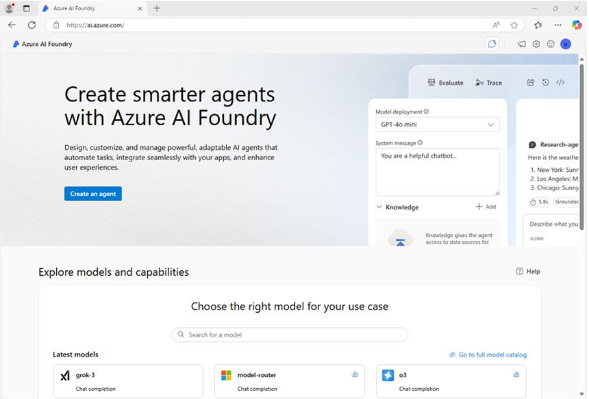
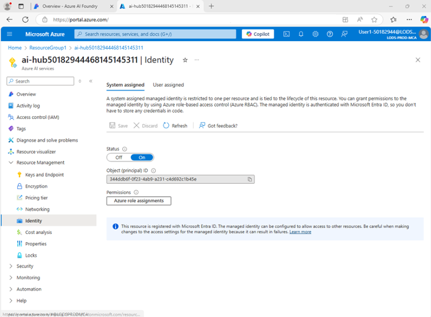
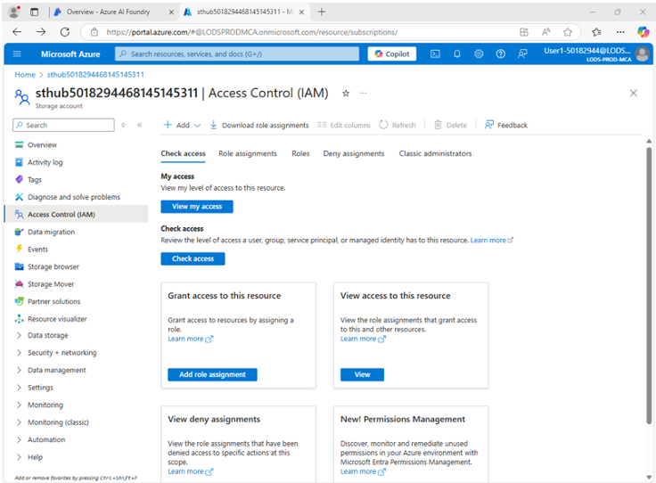
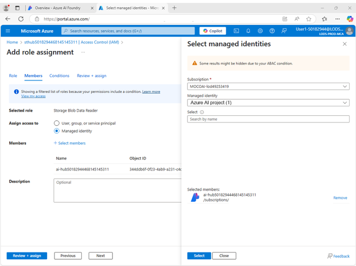
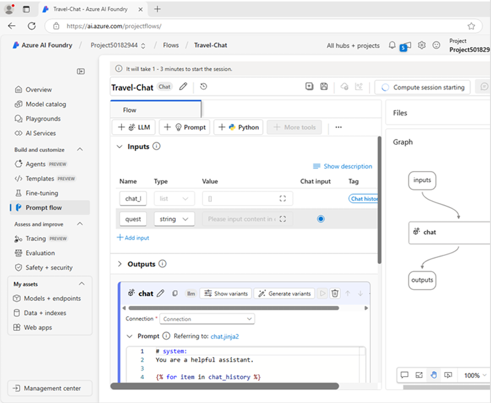
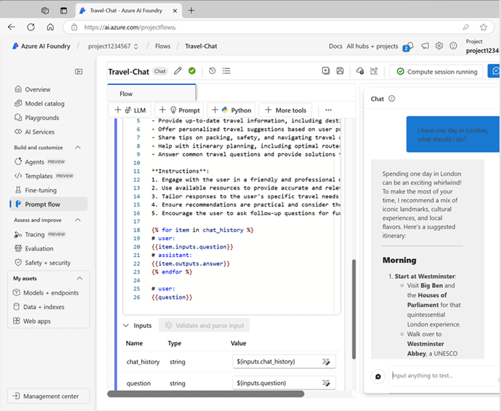
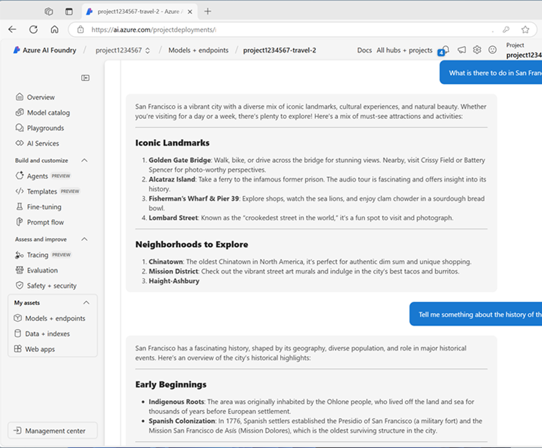

# Use a prompt flow to manage conversation in a chat app

In this exercise, you'll use Microsoft Foundry portal's prompt flow to create a custom
chat app that uses a user prompt and chat history as inputs, and uses a GPT model from
Azure OpenAI to generate an output.

## Create a Foundry hub and project

> **Note:** Please check with your instructor if the Foundry hub, project, and model are
> already deployed. If they are, feel free to jump to the next section in this document:
> **Create a prompt flow**.

The features of Foundry we're going to use in this exercise require a project that is
based on a Foundry hub resource.

1. In a web browser, open the Foundry portal at
   https://ai.azure.com and sign in using your Azure credentials.

   Close any tips or quick start panes that are opened the first time you sign in.
   If necessary, use the Foundry logo at the top left to navigate to the home page,
   which looks similar to the following image. Close the Help pane if it's open.

   

2. In the browser, navigate to
   https://ai.azure.com/managementCenter/allResources and select **Create new**.

   Then choose the option to create a new **AI hub resource**.

3. In the **Create a project** wizard:

   - Enter a valid name for your project.
   - Select the option to create a new hub.
   - Use the **Rename hub** link to specify a valid name for your new hub.
   - Expand **Advanced options**.
   - Specify the following settings for your project:

     - **Subscription:** Your Azure subscription
     - **Resource group:** Create or select a resource group
     - **Region:** East US 2 or Sweden Central

     > **Note:** In the event of a quota limit being exceeded later in the exercise,
     > you may need to create another resource in a different region.

   > **Note:** If you're working in an Azure subscription in which policies are used to
   > restrict allowable resource names, you may need to use the link at the bottom of
   > the **Create a new project** dialog box to create the hub using the Azure portal.

   > **Tip:** If the **Create** button is still disabled, be sure to rename your hub
   > to a unique alphanumeric value.

4. Wait for your project to be created.

## Configure resource authorization

The prompt flow tools in Foundry create file-based assets that define the prompt flow
in a folder in blob storage. Before exploring prompt flow, let's ensure that your
Foundry resource has the required access to the blob store so it can read them.

1. In a new browser tab, open the Azure portal at
   https://portal.azure.com, signing in with your Azure credentials if prompted.

   View the resource group containing your Azure AI hub resources.

2. Select the Foundry resource for your hub to open it.

   Then expand its **Resource Management** section and select the **Identity** page.

   

3. If the status of the system assigned identity is **Off**, switch it **On** and save
   your changes.

   Then wait for the change of status to be confirmed.

4. Return to the resource group page, and then select the **Storage account** resource
   for your hub and view its **Access Control (IAM)** page.

   

5. Add a role assignment to the **Storage Blob Data Reader** role for the managed
   identity used by your Foundry project resource.

   

6. When you've reviewed and assigned the role access to allow the Foundry managed
   identity to read blobs in the storage account, close the Azure portal tab and return
   to the Foundry portal.

## Deploy a generative AI model

Now you're ready to deploy a generative AI language model to support your prompt flow
application.

1. In the pane on the left for your project, in the **My assets** section, select the
   **Models + endpoints** page.

2. In the **Models + endpoints** page, in the **Model deployments** tab, in the
   **+ Deploy model** menu, select **Deploy base model**.

3. Search for the **gpt-4o** model in the list, and then select and confirm it.

4. Deploy the model with the following settings by selecting **Customize** in the
   deployment details:

   - **Deployment name:** A valid name for your model deployment
   - **Deployment type:** Global Standard
   - **Automatic version update:** Enabled
   - **Model version:** Select the most recent available version
   - **Connected AI resource:** Select your Azure OpenAI resource connection
   - **Tokens per Minute Rate Limit (thousands):** 50K, or the maximum available
     in your subscription if less than 50K
   - **Content filter:** DefaultV2

   > **Note:** Reducing the TPM helps avoid over-using the quota available in the
   > subscription you are using. 50,000 TPM should be sufficient for the data used in
   > this exercise.

   If your available quota is lower than this, you will be able to complete the
   exercise but you may experience errors if the rate limit is exceeded.

5. Wait for the deployment to complete.

## Create a prompt flow

A prompt flow provides a way to orchestrate prompts and other activities to define an
interaction with a generative AI model.

In this exercise, you'll use a template to create a basic chat flow for an AI assistant
in a travel agency.

1. In the Foundry portal navigation bar, in the **Build and customize** section,
   select **Prompt flow**.

2. Create a new flow based on the **Chat flow** template, specifying `Travel-Chat`
   as the folder name.

   A simple chat flow is created for you.

   > **Tip:** If a permissions error occurs, wait a few minutes and try again,
   > specifying a different flow name if necessary.

3. To be able to test your flow, you need compute, and it can take a while to start.

   Select **Start compute session** to get it started while you explore and modify
   the default flow.

4. View the prompt flow, which consists of a series of inputs, outputs, and tools.

   You can expand and edit the properties of these objects in the editing panes on
   the left, and view the overall flow as a graph on the right.

   

5. View the **Inputs** pane, and note that there are two inputs:

   - Chat history
   - The user's question

6. View the **Outputs** pane and note that there's an output to reflect the model's
   answer.

7. View the **Chat LLM** tool pane, which contains the information needed to submit
   a prompt to the model.

8. In the **Chat LLM** tool pane, for **Connection**, select the connection for the
   Azure OpenAI service resource in your AI hub.

   Then configure the following connection properties:

   - **Api:** `chat`
   - **deployment_name:** The `gpt-4o` model you deployed
   - **response_format:** `{"type":"text"}`

9. Modify the **Prompt** field as follows, removing the `\` escape in the YAML loop:

   ```text
   # system:
   **Objective**: Assist users with travel-related inquiries, offering tips, advice, and
   recommendations as a knowledgeable travel agent.

   **Capabilities**:
   - Provide up-to-date travel information, including destinations, accommodations,
     transportation, and local attractions.
   - Offer personalized travel suggestions based on user preferences, budget, and travel
     dates.
   - Share tips on packing, safety, and navigating travel disruptions.
   - Help with itinerary planning, including optimal routes and must-see landmarks.
   - Answer common travel questions and provide solutions to potential travel issues.

   **Instructions**:
   1. Engage with the user in a friendly and professional manner, as a travel agent
      would.
   2. Use available resources to provide accurate and relevant travel information.
   3. Tailor responses to the user's specific travel needs and interests.
   4. Ensure recommendations are practical and consider the user's safety and comfort.
   5. Encourage the user to ask follow-up questions for further assistance.

   
   # user:
   {{item.inputs.question}}
   # assistant:
   {{item.outputs.answer}}
   

   # user:
   {{question}}
````

Read the prompt you added so you are familiar with it.

It consists of:

* A **system message**, which includes an objective, a definition of its capabilities,
  and some instructions.
* The **chat history**, ordered to show each user question input and each previous
  assistant answer output.

10. In the **Inputs** section for the Chat LLM tool, under the prompt, ensure the
    following variables are set:

    * **question (string):** `${inputs.question}`
    * **chat_history (string):** `${inputs.chat_history}`

11. Save the changes to the flow.

> **Note:** In this exercise, we'll stick to a simple chat flow, but note that the prompt
> flow editor includes many other tools that you could add to the flow, enabling you to
> create complex logic to orchestrate conversations.

## Test the flow

Now that you've developed the flow, you can use the chat window to test it.

1. Ensure the compute session is running.

   If not, wait for it to start.

2. On the toolbar, select **Chat** to open the Chat pane, and wait for the chat to
   initialize.

3. Enter the query:

   ```text
   I have one day in London, what should I do?
   ```

   Review the output.

   The Chat pane should look similar to this:

   

## Deploy the flow

When you're satisfied with the behavior of the flow you created, you can deploy the flow.

> **Note:** Deployment can take a long time, and can be impacted by capacity constraints
> in your subscription or tenant.

1. On the toolbar, select **Deploy** and deploy the flow with the following settings:

   **Basic settings:**

   * **Endpoint:** New
   * **Endpoint name:** Enter a unique name
   * **Deployment name:** Enter a unique name
   * **Virtual machine:** Standard_DS3_v2
   * **Instance count:** 1
   * **Inferencing data collection:** Disabled

   **Advanced settings:**

   * Use the default settings.

2. In Foundry portal, in the navigation pane, in the **My assets** section, select
   the **Models + endpoints** page.

   If the page opens for your `gpt-4o` model, use its back button to view all models
   and endpoints.

3. Initially, the page may show only your model deployments.

   It may take some time before the deployment is listed, and even longer before it's
   successfully created.

4. When the deployment has succeeded, select it.

   Then, view its **Test** page.

   > **Tip:** If the test page describes the endpoint as unhealthy, return to the
   > **Models + endpoints** page and wait a minute or so before refreshing the view
   > and selecting the endpoint again.

   

5. Enter the prompt:

   ```text
   What is there to do in San Francisco?
   ```

   Review the response.

6. Enter the prompt:

   ```text
   Tell me something about the history of the city.
   ```

   Review the response.

   The test pane should look similar to this.

7. View the **Consume** page for the endpoint, and note that it contains connection
   information and sample code that you can use to build a client application for your
   endpoint.

   This enables you to integrate the prompt flow solution into an application as a
   generative AI application.