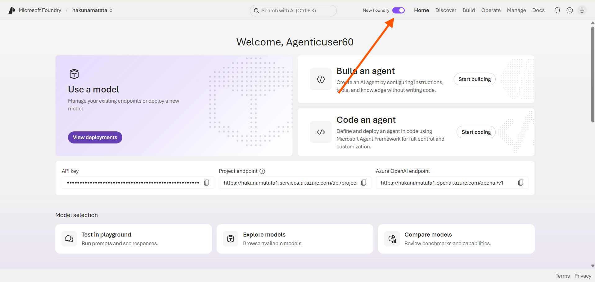
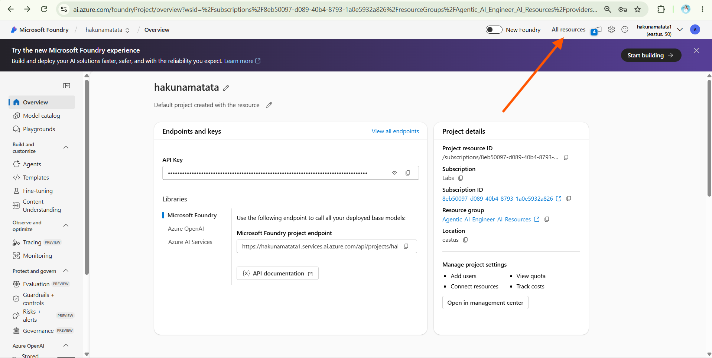
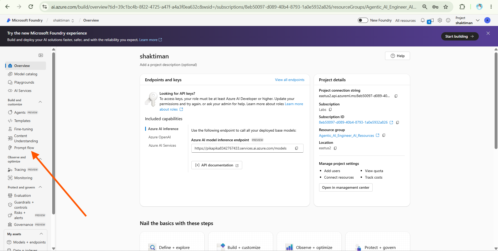

# Use a prompt flow to manage industry risk assessment

> **Note:** This lab uses the **Microsoft Foundry classic UI** because Prompt Flow is a legacy feature and is not available in the new Microsoft Foundry experience. Microsoft has announced that Prompt Flow will be retired on **April 20, 2027**, and recommends **Microsoft Agent Framework** for new development. This lab is provided to help you understand how Prompt Flow works and how its components are structured.

In this exercise, you'll use Microsoft Foundry's Prompt Flow to create and test a custom AI workflow for the **Credit Risk Assessment** use case. The flow will use an **Industry Risk Matrix** to assess a client's industry and return both the associated risk category and its score contribution to the overall credit risk assessment.

## Day 3 Use Case Context

When a company applies for credit, there are several things to check before deciding how much credit to offer and under what terms. One of these checks is the industry the company operates in.

Some industries are generally considered lower risk, while others may have higher operational, financial, or market-related risks. In this lab, you'll build an AI-powered industry assessment workflow using Prompt Flow. The workflow uses an **Industry Risk Matrix** to classify a client's industry as Low, Medium, or High Risk.

The result can later be combined with other checks such as company status, compliance screening, financial analysis, and external credit bureau information to support the overall credit risk assessment.

The Industry Risk Matrix used in this exercise is:

| Risk Category | Industries |
|--------------|------------|
| Low Risk | Utilities, Government, Healthcare |
| Medium Risk | Manufacturing, FMCG Distribution, IT Services |
| High Risk | Construction, Real Estate Developers, Airlines, Commodity Trading, Startups, Mining & Metals |

This lab focuses only on Industry Risk Assessment. It does not calculate the final credit score or make the final lending decision.

## Prerequisites

For this lab, the following have already been configured:

- Open the [Microsoft Foundry portal](https://ai.azure.com/) and switch from the **new Microsoft Foundry UI** to the **classic UI**, as Prompt Flow is available in the classic experience. As shown in the image below, simply click the UI toggle to switch between the experiences. If a feedback prompt appears, select **Continue without feedback**.

    

- Microsoft Foundry hub and project
- Resource authorization and storage access
- Required Azure resources
- **GPT-5.4-mini** model deployment
- **Industry Risk Matrix** reference data

Use the existing resources and proceed directly to **Create a prompt flow**.

# Create a prompt flow

A prompt flow provides a way to connect prompts and other activities to build an interaction with a generative AI model. In this exercise, you'll create a simple flow that takes a client's industry as input, checks it against the Industry Risk Matrix, and returns the corresponding risk category and score contribution.

0. After changing to the classic UI, at the top you see **All resources**. Click it as shown in the image below.

    

1. You may see multiple hubs and projects. Select the **shaktiman** project, as it is already configured for this lab.

2. In the left navigation pane, under **Build and customize**, select **Prompt flow**.

    

3. Click **+ Create**, select **Chat flow**, and specify `Credit-Risk-Industry` as the folder name. A simple chat flow is created for you.
> Tip: If a permissions error occurs, wait a few minutes and try again, specifying a different flow name if necessary.

4. To test your flow, you need a compute session, and it can take a while to start; so select **Start compute session** and let it start while you explore and modify the default flow.

5. View the prompt flow, which consists of inputs, outputs, and tools. You can expand and edit the properties of these objects in the editing panes on the left and view the overall flow as a graph on the right.

6. View the **Inputs** pane and note the input used to receive the user's industry or question.

7. View the **Outputs** pane and note that there is an output for the model's Industry Risk Assessment.

8. View the **Chat LLM** tool pane, which contains the information needed to send the prompt to the model.

9. In the Chat LLM tool pane, for **Connection**, select the connection for the Azure OpenAI service resource in your AI hub. Then configure the following connection properties:

    a. Api: `chat`

    b. deployment_name: The existing **GPT-5.4-mini** deployment

    c. response_format: `{"type":"text"}`

10. Modify the **Prompt** field as follows:

    **# system:**

    **Objective**: Assess the risk level of a client's industry using the provided Industry Risk Matrix.

    The result will help support a broader credit risk assessment by identifying whether the client's industry is considered Low, Medium, or High Risk.

    **Industry Risk Matrix**:

    - **Low Risk**: Utilities, Government, Healthcare
    - **Medium Risk**: Manufacturing, FMCG Distribution, IT Services
    - **High Risk**: Construction, Real Estate Developers, Airlines, Commodity Trading, Startups, Mining & Metals

    **Instructions**:

    1. Identify the industry provided by the user.
    2. Match the industry against the Industry Risk Matrix.
    3. Assign the corresponding risk category: Low, Medium, or High.
    4. Return the response using the following format:

       Industry Identified: <industry>

       Risk Category: <Low Risk | Medium Risk | High Risk>

       Industry Risk Score Contribution: <score>

    5. Use the following score contribution values:
       - Low Risk = 15 points
       - Medium Risk = 8 points
       - High Risk = 3 points
    6. If the industry does not clearly match an entry in the matrix, indicate that manual review is required instead of assigning a risk category with certainty.
    7. Do not evaluate other credit risk factors such as financial statements, sanctions checks, bureau scores, company registration records, compliance screening, or final credit decisions.

    **# user:**

    `{{question}}`

    Read the prompt you added so you are familiar with it. It tells the model what to look for, provides the Industry Risk Matrix, defines the score contribution for each category, and explains what to do when an industry is not listed.

11. In the **Inputs** section for the Chat LLM tool (under the prompt), ensure the following variable is set:

    a. question (string): `${inputs.question}`

12. Save the changes to the flow.

> **Note:** This lab focuses only on Industry Risk Assessment. A complete credit risk evaluation would also consider factors such as company status, compliance and sanctions checks, financial performance, and external credit ratings. These areas are explored in later labs.

# Test the flow

Now that you've built the flow, use the chat window to check how it handles different industries.

1. Ensure the compute session is running. If not, wait for it to start.

2. On the toolbar, select **Chat** to open the Chat pane and wait for the chat to initialize.

3. Test the following industries:
   - `Utilities`
   - `Healthcare`
   - `Manufacturing`
   - `IT Services`
   - `Construction`
   - `Mining & Metals`

4. Check that each industry is assigned the correct risk category based on the Industry Risk Matrix.

5. Check that the corresponding Industry Risk score contribution is also returned:
   - Low Risk → 15 points
   - Medium Risk → 8 points
   - High Risk → 3 points

6. Test an industry that is not listed in the Industry Risk Matrix, such as `Renewable Energy`, `Biotechnology`, or `Logistics`, and verify that the flow recommends manual review instead of assigning a risk category with certainty.

# Lab Summary

In this lab, you built and tested an Industry Risk Assessment workflow using Microsoft Foundry Prompt Flow as part of a larger Credit Risk Assessment solution.

You:

- Used an existing Microsoft Foundry project and model deployment
- Created and configured a Prompt Flow
- Configured an LLM node using the existing **GPT-5.4-mini** deployment
- Added an Industry Risk Matrix to the prompt
- Classified client industries into Low, Medium, and High risk categories
- Returned the Industry Risk score contribution used by the broader credit assessment
- Tested the flow with different industry scenarios

The Industry Risk result from this lab can later be combined with company checks, compliance screening, financial analysis, and external credit information to support the overall credit risk assessment.

**Congratulations, you have completed Day 3 - Lab02 Industry Risk Assessment.**

Please close the current document and move to the next one.