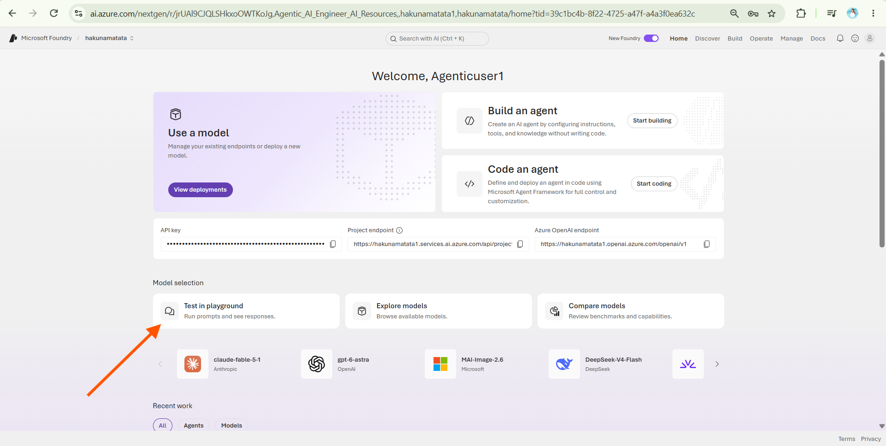
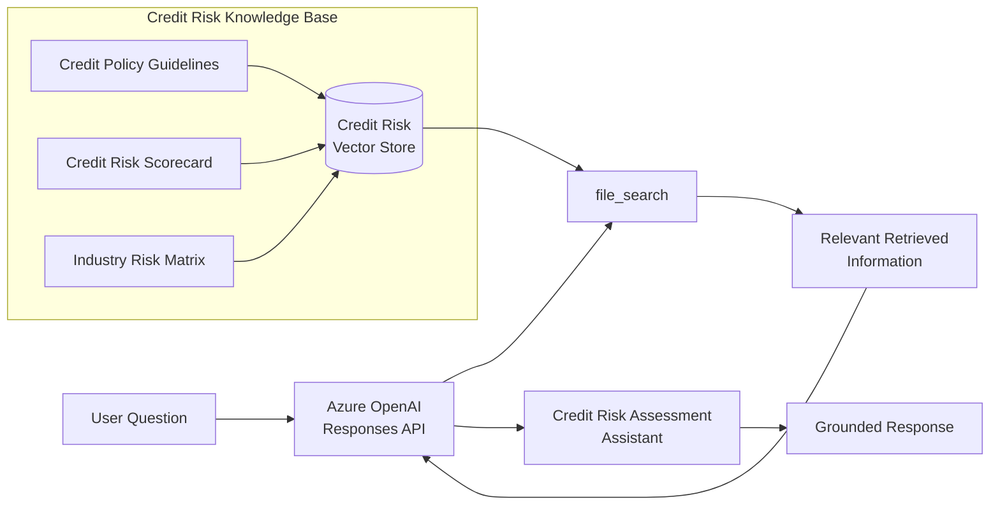
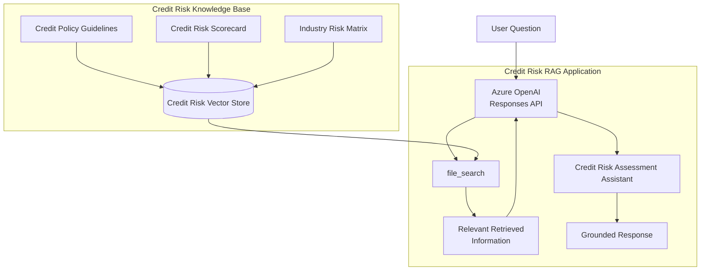

---
lab:
  title: Create a Credit Risk Assessment Application with Retrieval-Augmented Generation (RAG)
  description: Learn how to build a credit risk assessment application using Retrieval-Augmented Generation (RAG) and the file_search tool.
  level: 300
  duration: 45
  islab: true
  status: 'released'
---

# Create a Credit Risk Assessment Application with Retrieval-Augmented Generation (RAG)

Before starting this exercise, install Azure CLI if it is not already installed.

Install Azure CLI using the [Azure CLI installation guide](https://aka.ms/installazurecliwindows) and complete the installation.

In this exercise, you'll use the Microsoft Foundry portal and the Responses API to build a **Credit Risk Assessment application**.

You will:

- Explore the deployed model in the Chat Playground.
- Create a credit risk knowledge base using reference documents.
- Create a vector store.
- Upload credit risk reference documents.
- Use the `file_search` tool to retrieve relevant information.
- Generate grounded responses using the retrieved information.
- Test the application with credit risk questions.

This exercise takes approximately **45 minutes**.

> **Note:** Some of the technologies used in this exercise are in preview or in active development. You may experience unexpected behavior, warnings, or errors.

## Prerequisites

Before starting this exercise, ensure you have:

- An active [Azure subscription](https://azure.microsoft.com/pricing/purchase-options/azure-account)
- [Visual Studio Code](https://code.visualstudio.com/) installed
- [Python 3.12 or above](https://www.python.org/downloads/) installed
- [Azure CLI](https://learn.microsoft.com/cli/azure/install-azure-cli) installed

> **Note:** The lab has been tested with Python 3.12.

## Experiment with the model in the playground

Before building the **Credit Risk Assessment** application, explore the model in the Chat Playground and then connect it to the credit risk knowledge base.

This gives you a baseline for understanding how the model answers questions **before it has access to the organization's credit risk knowledge base**.

1. Open the [Microsoft Foundry portal](https://ai.azure.com/).

2. Ensure that you are in the **hakunamatata1** project.

3. On the **Home** page, scroll to the **Model selection** section.

4. Locate the deployed model card and select **Test in playground**.

   > **Note:** Selecting **Test in playground** opens the **Chat Playground**, where you can interact with the deployed model and review its responses.

   

5. In the **Instructions** field, enter the following prompt and select **Apply Changes**:

   ```text
   You are a Credit Risk Assessment Assistant.
    ````

6. In the chat pane, enter:

   ```text
   Which industries are classified as High Risk?
   ```

7. Review the response. The response may be generic because the model does not yet have access to the organization's credit risk knowledge base.

8. Under the **Tools** section, select **Add** and choose **Upload files**.

9. Open the [credit risk text files](https://github.com/Kiran-255666/AgenticAIEngineer/tree/main/textfiles) from the training repository and download these three `.txt` files:

   * `Industry_Risk_Matrix.txt`
   * `credit_risk_scorecard.txt`
   * `credit_policy_guidelines.txt`

   Upload the files **one at a time** to the Playground.

   > **Important:** Upload one file at a time and wait until it shows **Success** before uploading the next one. If a file fails, use the side scroll bar to find the **Delete** button, remove the failed file, and upload it again. Wait until **all three files show Success**. Once all three are successful, select **Attach** to continue.

10. Ask the same question again:

    ```text
    Which industries are classified as High Risk?
    ```

11. Compare the new response with the previous response. The model should now retrieve relevant information from the uploaded documents and provide a more grounded response.

12. Try another question:

    ```text
    What credit limit is recommended for a Low Risk customer?
    ```

13. Review the response and observe how the model uses information from the uploaded credit risk knowledge base.

This demonstrates the difference between the model responding **without organization-specific context** and responding with information retrieved from the **credit risk knowledge base**.

In the next section, you'll build a **Retrieval-Augmented Generation (RAG)** application using Python, a vector store, and the `file_search` tool to automate this retrieval process.

## Create a Credit Risk RAG application

Now that you've explored the model with and without the credit risk knowledge base, let's build a client application that uses **RAG** to retrieve relevant information from the credit risk documents and generate grounded responses.

The application follows this workflow:



The three documents used by the application are:

* **Credit Policy Guidelines**
* **Credit Risk Scorecard**
* **Industry Risk Matrix**

The `file_search` tool retrieves relevant information from the vector store so that the model can generate a response grounded in the uploaded documents.

## Get the application files from GitHub

The application files for the Credit Risk RAG application are provided in the [training repository](https://github.com/Kiran-255666/AgenticAIEngineer).

1. Open the [training repository](https://github.com/Kiran-255666/AgenticAIEngineer) in a browser.

2. Select **Code** and then select **Download ZIP**.

   > **Tip:** Before downloading, make sure there are no existing copies of the repository, ZIP files, or extracted folders in your **Downloads** or **Desktop** folders. We will use PowerShell commands in the next steps to avoid Windows long-path issues, and duplicate copies in these locations can cause path conflicts.

3. Once the ZIP file has downloaded, open the **Downloads** folder.

4. Right-click the ZIP file and select **Extract All**.

   > **Important:** Do not run the application directly from the deeply nested extracted folder in `Downloads`. The long Windows path can cause path-related problems in the VM.

5. After extracting the repository, open **PowerShell**.

6. Copy the Credit Risk RAG lab to the Desktop using the shorter folder name `lab03-RAG`:

   ```powershell
   Copy-Item "$env:USERPROFILE\Downloads\AgenticAIEngineer-main\AgenticAIEngineer-main\labfiles\Day03\lab03-RAG-with-Azure-AI-Foundry" "$env:USERPROFILE\Desktop\lab03-RAG" -Recurse
   ```

   > **Note:** The source path should normally match the extracted repository folder name. If the extracted folder name is different, update the source path accordingly.

7. Move into the copied lab folder:

   ```powershell
   cd "$env:USERPROFILE\Desktop\lab03-RAG"
   ```

8. Open the application folder in Visual Studio Code:

   ```powershell
   code .
   ```

Your application should now be located at a short path similar to:

```text
C:\Users\<username>\Desktop\lab03-RAG
```

This keeps the working folder path short and helps avoid Windows long-path issues.

## Create the virtual environment

Open the integrated terminal in Visual Studio Code and run:

```powershell
python -m venv labenv

.\labenv\Scripts\Activate.ps1
```

> **Note:** If `python -m venv labenv` returns an error in the Virtual Machine, use the Windows Python Launcher instead:

```powershell
py -m venv labenv

.\labenv\Scripts\Activate.ps1
```

> **Tip:** If PowerShell blocks the activation script, run:

```powershell
Set-ExecutionPolicy -Scope Process -ExecutionPolicy Bypass
```

Then activate the environment again:

```powershell
.\labenv\Scripts\Activate.ps1
```

After activation, your terminal should show `(labenv)` before the path.

## Install the required packages

Run:

```powershell
pip install -r requirements.txt
```

The required packages are:

```text
python-dotenv
azure-identity
openai
```

## Configure the environment variables

The `.env` file is already prefilled with the required Azure OpenAI endpoint and model deployment name.

**No changes are required.**

If you need to configure the file manually, use:

```env
AZURE_OPENAI_ENDPOINT="https://<resource-name>.services.ai.azure.com/openai/v1/"
MODEL_DEPLOYMENT_NAME="<your-model-deployment-name>"
```

Replace `<resource-name>` and `<your-model-deployment-name>` with the values from your Microsoft Foundry project.

> **Important:** The deployment name is not necessarily the same as the model name. Use the exact deployment name configured in your project.

## Review the knowledge base

The `knowledge_base` folder contains three PDF documents:

```text
knowledge_base/
│
├── credit_policy_guidelines.pdf
├── credit_risk_scorecard.pdf
└── Industry_Risk_Matrix.pdf
```

These documents provide the information that the application retrieves when answering questions.

The knowledge base covers topics such as:

* Industry risk classifications
* Industry risk scores
* Credit risk scoring
* Credit limits
* Payment terms
* Credit policy guidelines
* Required documentation
* Compliance requirements
* Approval and override rules

## Review the application code

Open `rag.py` in Visual Studio Code.

The main functions and required code are already prefilled in `rag.py`.

> **Note:** You only need to review and understand the code. Do not rewrite or restructure it, as this can cause indentation or formatting issues.

The application:

1. Loads configuration from `.env`.
2. Authenticates using Azure CLI credentials.
3. Initializes the OpenAI client.
4. Creates a vector store for the credit risk knowledge base.
5. Finds PDF documents in the `knowledge_base` folder.
6. Uploads the documents to the vector store.
7. Uses `file_search` to retrieve relevant information.
8. Sends the user's question to the model.
9. Displays a response grounded in the uploaded documents.

## Review the credit risk knowledge base

The vector store and document upload logic are already included in `rag.py`.

Review this section to understand how the application:

* Creates the `credit-risk-knowledge-base` vector store.
* Finds PDF files in the `knowledge_base` folder.
* Uploads the documents to the vector store.
* Waits for the upload to complete.
* Reports the number of successfully uploaded documents.

```python
print("Creating credit risk knowledge base and uploading documents...")

vector_store = openai_client.vector_stores.create(
    name="credit-risk-knowledge-base"
)

file_streams = [
    open(f, "rb")
    for f in glob.glob("knowledge_base/*.pdf")
]

if not file_streams:
    print("No PDF files found in the knowledge_base folder!")
    return

file_batch = openai_client.vector_stores.file_batches.upload_and_poll(
    vector_store_id=vector_store.id,
    files=file_streams
)

for f in file_streams:
    f.close()

print(
    f"Uploaded {file_batch.file_counts.completed} "
    "knowledge documents successfully."
)
```

> **Note:** This code is already prefilled. Review it to understand how the knowledge base is created. No changes are required.

## Review how `file_search` is used

The `Responses API` and `file_search` configuration are already included in `rag.py`.

Review this section to understand how the application:

1. Sends the user's question to the model.
2. Connects the model to the credit risk vector store.
3. Uses `file_search` to retrieve relevant information from the uploaded documents.
4. Generates a response based on the retrieved information.

The relevant configuration is:

```python
tools=[
    {
        "type": "file_search",
        "vector_store_ids": [vector_store.id]
    }
]
```

This connects the Responses API to the credit risk vector store, allowing the application to search the uploaded documents before generating an answer.

> **Note:** The code is already prefilled in `rag.py`. Do not retype or modify it unless instructed. Focus on understanding how the different parts work together.

## Sign in to Azure

Before running the application, verify that Azure CLI is authenticated.

1. Run:

   ```powershell
   az account show
   ```

2. If your Azure account details are displayed, you are already signed in.

3. If you receive an authentication error, run:

   ```powershell
   az logout
   az login
   ```

4. Sign in using your Azure credentials.

5. If you're prompted to select a subscription or tenant, select the appropriate option.

6. Verify the account again:

   ```powershell
   az account show
   ```

> **Note:** If you face authentication or access-related errors while running the application, try `az logout` followed by `az login`, then sign in again with your Azure credentials.

## Run the application

Make sure the virtual environment is active:

```text
(labenv)
```

Then run:

```powershell
python rag.py
```

If `python` is not available, you can use:

```powershell
py rag.py
```

The application should display:

```text
Creating credit risk knowledge base and uploading documents...

Uploaded 3 knowledge documents successfully.

Enter a question (or type "quit" to exit):
```

## Test the Credit Risk RAG application

### Test 1: Industry Risk Matrix

Enter:

```text
Which industries are classified as High Risk?
```

The application should retrieve relevant information from the **Industry Risk Matrix** and provide a grounded response.

### Test 2: Credit Risk Scorecard

Enter:

```text
What is the Industry Risk Score for High Risk industries?
```

This tests retrieval of scoring information from the credit risk documentation.

### Test 3: Credit Policy Guidelines

Enter:

```text
What credit limit is recommended for a Low Risk customer?
```

This tests retrieval of credit limit information from the knowledge base.

### Test 4: Documentation requirements

Enter:

```text
What happens if mandatory documentation is missing?
```

This tests retrieval of policy and compliance requirements.

## Try a multi-document question

To demonstrate how RAG can retrieve information from different parts of the knowledge base, try:

```text
Explain how industry risk affects the overall credit assessment.
```

Then try:

```text
How do industry risk, credit score, credit limits, and payment terms relate to each other?
```

The response should use relevant information from the uploaded credit risk documents rather than relying only on the model's general knowledge.

## Understand the RAG workflow



The key stages are:

1. **Credit risk documents** are uploaded to the vector store.
2. The user asks a question.
3. The **Responses API** receives the question.
4. The `file_search` tool searches the vector store.
5. Relevant information is retrieved from the documents.
6. The model uses the retrieved information to generate the response.
7. The user receives a **grounded response**.

## Compare the results

At the beginning of the exercise, you asked the model:

```text
Which industries are classified as High Risk?
```

before connecting the knowledge base.

Now ask the same question again:

```text
Which industries are classified as High Risk?
```

Compare the two responses.

This demonstrates the difference between:

* **Model-only responses**
* **Knowledge-base-grounded RAG responses**

The RAG application can retrieve information from the organization's credit risk documents before generating its answer.

## Exit the application

When you are finished testing, enter:

```text
quit
```

The application will exit.

## Summary

In this exercise, you:

* Explored a deployed model in the Microsoft Foundry Chat Playground.
* Created a credit risk knowledge base.
* Uploaded three credit risk PDF documents.
* Created a vector store.
* Used the OpenAI Responses API.
* Connected the vector store to the `file_search` tool.
* Retrieved relevant information from the knowledge base.
* Generated grounded credit risk responses.
* Compared model-only responses with RAG responses.

You have now built a basic **Credit Risk Assessment RAG application** using Microsoft Foundry, Azure OpenAI, the OpenAI SDK, vector stores, and `file_search`.
